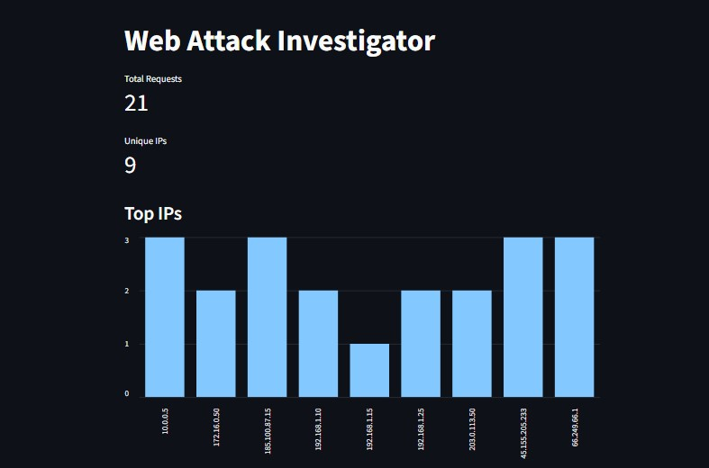
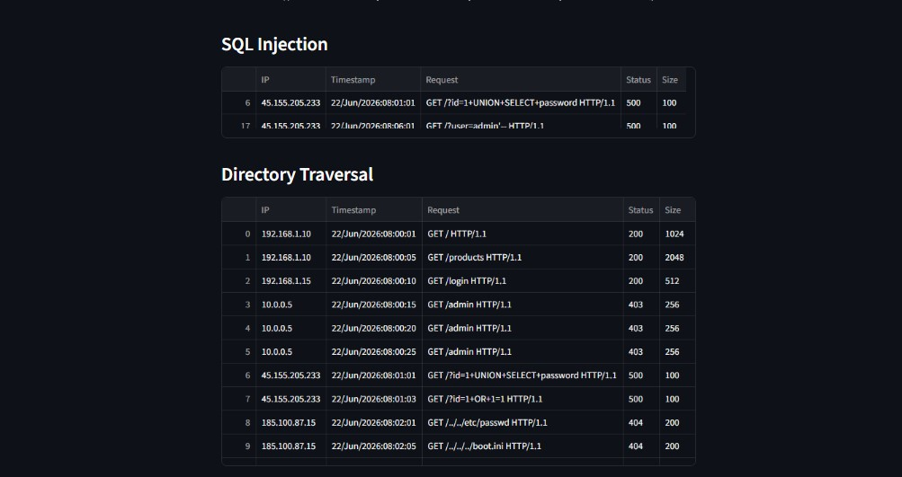

# Web Attack Investigator

Ferramenta de investigação de ataques web desenvolvida em Python para análise de logs Apache/Nginx, identificação de indicadores de comprometimento (IOCs), detecção de ataques e geração automatizada de relatórios.

## Objetivo

Este projeto foi desenvolvido com foco em atividades de Security Operations Center (SOC) e Blue Team, permitindo identificar tentativas de exploração em aplicações web, analisar evidências e gerar relatórios para suporte a investigações de segurança.

## Funcionalidades

- Análise de logs Apache/Nginx
- Detecção de SQL Injection
- Detecção de Directory Traversal
- Identificação de Indicadores de Comprometimento (IOCs)
- Dashboard interativo com Streamlit
- Geração de relatórios TXT, HTML e XLSX
- Estatísticas de IPs e códigos HTTP
- Mapeamento MITRE ATT&CK

## Tecnologias Utilizadas

- Python
- Pandas
- Streamlit
- OpenPyXL
- Matplotlib

## Dashboard





## MITRE ATT&CK

| Técnica | Descrição |
|----------|----------|
| T1190 | Exploit Public-Facing Application |

## Competências Demonstradas

- Análise de Logs
- Investigação de Incidentes
- Threat Hunting
- Blue Team
- SOC Operations
- Python para Segurança
- MITRE ATT&CK Framework
- Detecção de Indicadores de Comprometimento (IOCs)

## Como Executar

### 1. Clonar o repositório

```bash
git clone https://github.com/RodrigoTorbes/Web-Attack-Investigator.git

cd Web-Attack-Investigator
```

### 2. Criar ambiente virtual

```bash
python -m venv venv
```

### Windows

```bash
venv\Scripts\activate
```

### Linux

```bash
source venv/bin/activate
```

### 3. Instalar dependências

```bash
pip install -r requirements.txt
```

### 4. Gerar relatório

```bash
python scripts/report_generator.py
```

### 5. Executar dashboard

```bash
streamlit run dashboard.py
```

## Estrutura do Projeto

```text
Web-Attack-Investigator/
│
├── data/
│   └── access.log
│
├── images/
│   ├── Screenshot_1.jpg
│   └── Screenshot_2.jpg
│
├── reports/
│   ├── report.txt
│   ├── report.html
│   └── report.xlsx
│
├── scripts/
│   ├── __init__.py
│   ├── parser.py
│   ├── attack_detector.py
│   ├── mitre_mapper.py
│   └── report_generator.py
│
├── dashboard.py
├── requirements.txt
└── README.md
```

## Exemplo de Detecções

### SQL Injection

```text
GET /?id=1+UNION+SELECT+password HTTP/1.1
GET /?id=1+OR+1=1 HTTP/1.1
```

### Directory Traversal

```text
GET /../../etc/passwd HTTP/1.1
GET /../../../boot.ini HTTP/1.1
```

## Próximas Melhorias

- Exportação PDF
- Geolocalização de IPs
- Upload de logs via interface web
- Detecção de Brute Force
- Detecção de Scanners (Nmap, Nikto, SQLMap)
- Dashboard avançado com filtros
- Integração com MITRE ATT&CK Navigator

## Autor

**Rodrigo Horvath Torbes**

- GitHub: https://github.com/RodrigoTorbes
- Projeto desenvolvido para estudos de Blue Team, SOC e Resposta a Incidentes.
